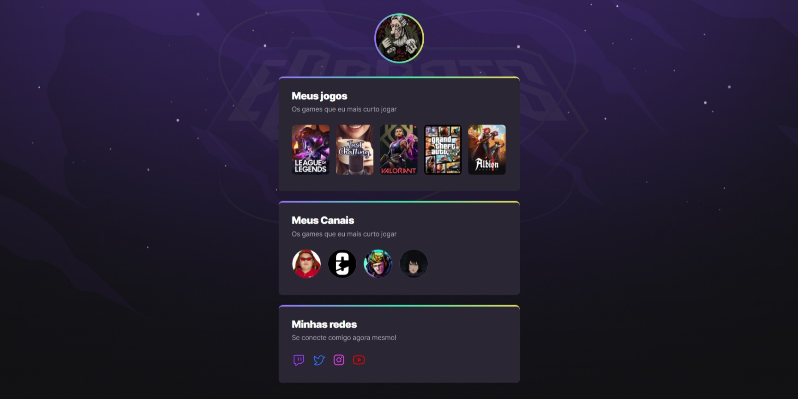

# NLW eSports

> Trilha Explorer

Projeto construido no evento Next Level Week da Rocketseat.

[Clique aqui para acessar](https://ericktafarel.github.io/NLW-eSports/)

## O que aprendi?

- Como funciona para utilizar imagens svg.
- Aprendi como formatar a pagina com css.
- Aprendi a fazer animações com css.

## Comandos que aprendi

- box-sizing: border-box;
- line-height: ;
- letter-spacing: ;
- calc( );
- background-image: linear-gradient( );
- display: flex;
- display: grid;
- gap: ;
- transition: ;
- animation: ;
- animation-delay; ;
- transform: scale( );
- :nth-child( ){ }
- @keyframes { }

## Tecnologias

- HMTL
- CSS
- GIT & Github

## Contato

ericktafarel@gmail.com